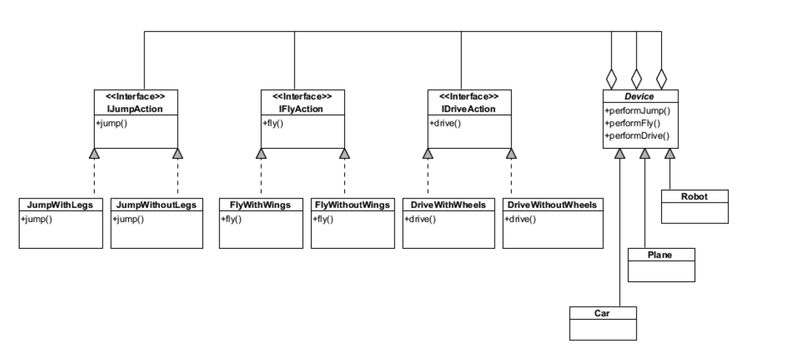

# UML (Unified modeling language)

диаграмма классов содержит (только?) важные сущности и отношения между ними

Сущности (entity)

Свойства (или атрибуты)

Поведение – это методы класса и объекта, которые взаимодействуют с другими объектами и меняют состояние объектов и всей системы. Свойства и методы в UML диаграмме классов, как и в ООП-языках программирования, могут иметь разную область видимости:
• публичная (public), обозначается как “+”, элементы с такой областью видимости доступны через интерфейс сущности без ограничений;
• скрытая (private), обозначается как “-”, элементы скрыты и используются для внутренних целей;
• защищенная (protected), обозначается как “#”, элементы доступны в экземплярах классов и их потомках.

Поведения, служащие для доступа извне к скрытым свойствам, путем объявления методов для возвращения значения свойств или установки свойств по переданному новому их значению, называются, соответственно, геттерами (getter) и сеттерами (setter).

Сущность может моделировать обычный объект или описывать интерфейс.

Интерфейс – это класс, экземпляры которого не создаются, он служит для контрактного описания свойств и поведения. В программах объекты создаются как производные от классов, расширяя базовые классы (генерализация), кроме этого, они могут следовать неким интерфейсам (имплементировать их), т.е. обязательно содержать свойства и реализовывать поведения, присущие заданным интерфейсам.

В некоторых языках вводится понятие абстрактного класса как интерфейса, который содержит реализации для некоторых методов. В UML абстрактный класс обозначается классом с именем класса, оформленный курсивом.

Абстрактный метод (обозначается курсивом) декларирует поведение, которое должно быть реализовано в классе-потомке или в реализации интерфейса.

Методы, принадлежащие классу, могут иметь доступ только к статическим свойствам класса и могут быть вызваны без создания экземпляра класса. Такие свойства и методы называются статическими.

Диаграмма классов также позволяет промоделировать основные отношения между классами, это:
• использование;
• ассоциация;
• агрегация;
• композиция.

Отношение использования (<<use>>) моделирует ситуацию, когда в коде какого-то метода одного класса создается и используется экземпляр другого

Ассоциация – в общем случае, зависимость между двумя классами с заданной мощностью. Ассоциация может быть направленной (на диаграмме рисуется стрелка, указывающая направление), также может именоваться.

Мощность отношения – по аналогии с базами данных задает возможное количество объектов по отношению к одной стороны связи к количеству объектов с другой стороны, это один-ко-многим, один-к-одному, много-ко-многим (обычно заменяется на две связи один-ко- многим с созданием дополнительного класса). В UML применяются также мощности вида 0..1 или 0..\*, указывающие на то, что с заданной стороны связи объекта может не быть

Агрегация – это случай ассоциации, когда требуется промоделировать операцию включения одного объекта в другой (отношение целое-часть целого).

Композиция – случай агрегации, когда включаемый объект не может существовать сам по себе без своего контейнера (или класса-родителя, класса, агрегирующего данный класс).

Example

Simple

