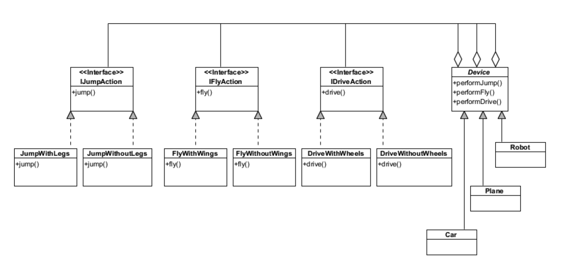

# UML (Unified Modeling Language)

## Class Diagram Overview

**Class Diagram Overview:**

A class diagram in UML primarily focuses on depicting significant entities and their relationships within a system.

- **Entities (Classes):** Entities represent the key components or objects within a system.

- **Attributes (Properties):** Each entity is characterized by its attributes or properties, which define the state of the entity.

- **Behavior:** Behavior refers to the methods or functions associated with a class or object that interact with other objects and alter the state of the objects and the overall system. In a UML class diagram, similar to object-oriented programming (OOP) languages, properties and methods can have different levels of visibility:
    - **Public (+):** Public elements are accessible through the entity's interface without any restrictions.
    - **Private (-):** Private elements are hidden and used internally within the class.
    - **Protected (#):** Protected elements are accessible within the class instances and their descendants.

  Behaviors that allow external access to private properties, typically through methods designed to retrieve (getters) or set (setters) these properties, are referred to as getters and setters, respectively.

- **Entities and Interfaces:** An entity can model a regular object or describe an interface.

- **Interface:** An interface is a class that does not have instances and serves as a contractual description of properties and behaviors. In programs, objects are created as derivatives of classes (generalization), extending base classes. Additionally, they may implement interfaces, meaning they must include properties and implement behaviors specified by the given interfaces.

    - In some programming languages, the concept of an abstract class is introduced as an interface that contains implementations for certain methods. In UML, an abstract class is represented by a class name written in italics.

    - **Abstract Method:** An abstract method (italicized) declares behavior that must be implemented in a subclass or interface implementation.

    - Methods belonging to a class may only have access to the class's static properties and can be invoked without creating an instance of the class. Such properties and methods are called static.

**Relationships Between Classes:**

Class diagrams also allow the modeling of fundamental relationships between classes, including:
- **Usage (<<use>>):** Models a scenario where an instance of one class is created and used within a method of another class.
- **Association:** Generally, an association represents a dependency between two classes with specified multiplicity. An association can be directional (indicated by an arrow) and may also be named.
- **Multiplicity:** Similar to databases, multiplicity specifies the possible number of objects in relation to one side of a connection to the number of objects on the other side. This could be one-to-many, one-to-one, or many-to-many (often replaced by two one-to-many associations with an additional class). UML also uses multiplicities such as 0..1 or 0..*, indicating that there may not be an object on a given side of the connection.
- **Aggregation:** Aggregation is a type of association where one object includes another (whole-part relationship).
- **Composition:** Composition is a special case of aggregation where the included object cannot exist independently of its container (or parent class, the class aggregating the given class).

## Example Simple

